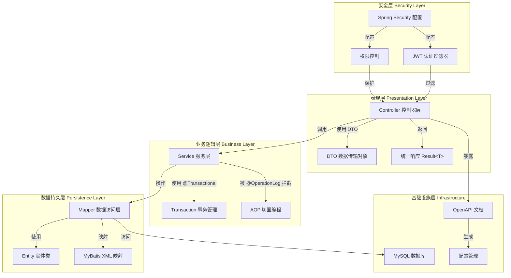
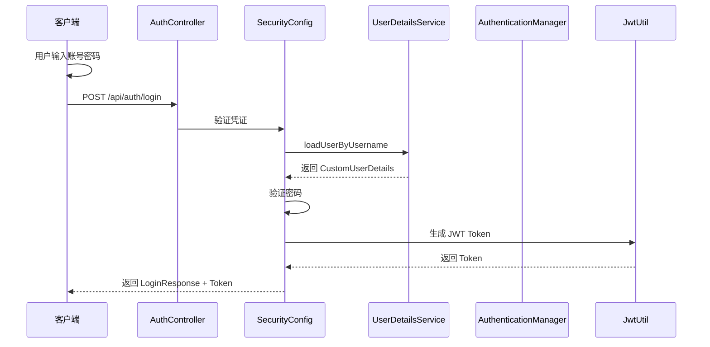
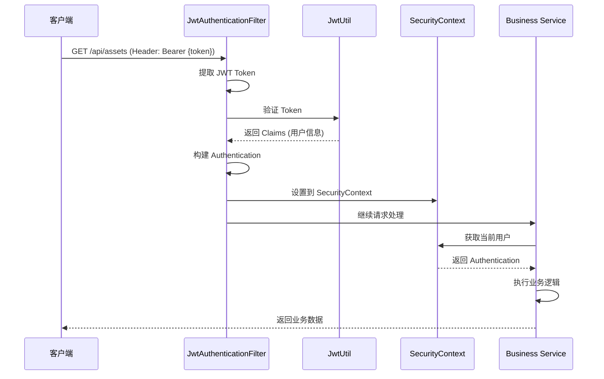
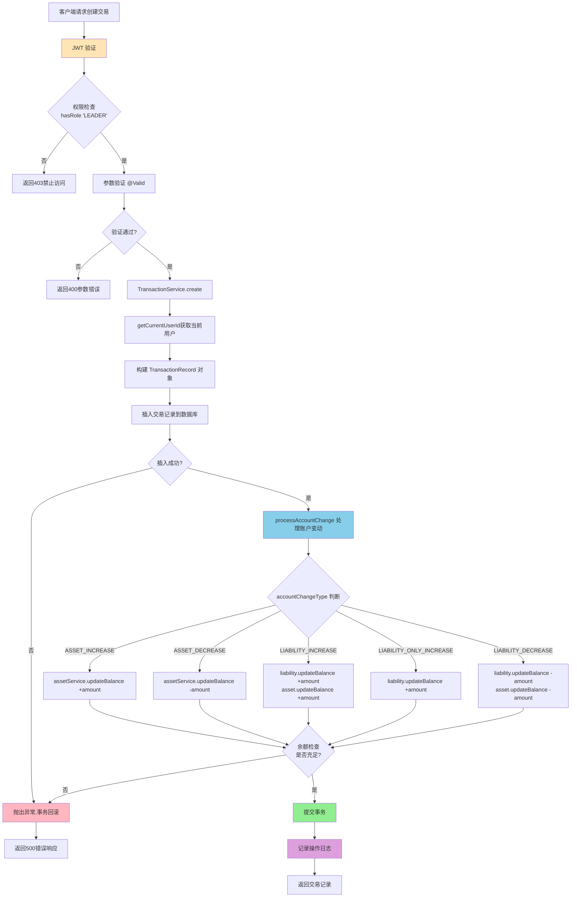

# 记账应用综合分析报告

**生成时间**: 2026-01-19
**分析范围**: 完整项目架构、数据流、设计模式、API接口、核心业务逻辑

---

## 目录

1. [系统架构概览](#1-系统架构概览)
2. [数据流分析](#2-数据流分析)
3. [设计模式与类关系](#3-设计模式与类关系)
4. [REST API 接口设计](#4-rest-api-接口设计)
5. [核心业务逻辑](#5-核心业务逻辑)
6. [质量评估](#6-质量评估)
7. [改进建议](#7-改进建议)

---

## 1. 系统架构概览

### 1.1 整体架构模式

本项目采用**经典的三层分层架构**，结合 **Spring MVC** 设计模式：



### 1.2 架构特点

- **分层清晰**：表现层、业务层、持久层职责明确，低耦合高内聚
- **前后端分离**：RESTful API 设计，支持多端接入
- **面向切面编程**：通过 AOP 实现横切关注点（操作日志）
- **声明式事务**：利用 Spring 的 `@Transactional` 管理事务边界
- **安全优先**：基于 JWT 的无状态认证 + RBAC 权限控制

### 1.3 技术栈

| 技术组件 | 版本 | 用途说明 |
|---------|------|---------|
| **Spring Boot** | 3.5.6 | 应用基础框架 |
| **Java** | 21 | 编程语言 |
| **Spring Security** | 3.5.6 | 认证与授权 |
| **MyBatis** | 3.0.3 | ORM 框架 |
| **MySQL** | 8.0+ | 关系型数据库 |
| **JJWT** | 0.11.5 | JWT Token 生成和解析 |
| **SpringDoc OpenAPI** | 2.3.0 | API 文档生成 |
| **Lombok** | Latest | 简化 Java 代码 |

### 1.4 模块划分

```
com.accounting/
├── AccountingApplication.java          # 应用启动类
├── annotation/                         # 自定义注解
├── aspect/                             # AOP 切面
├── common/                             # 公共组件
├── config/                             # 配置类
├── controller/                         # 控制器层
├── dto/                                # 数据传输对象
├── entity/                             # 实体类
├── mapper/                             # MyBatis Mapper
├── security/                           # 安全组件
├── service/                            # 服务层
└── util/                               # 工具类
```

---

## 2. 数据流分析

### 2.1 认证流程

#### 用户登录认证流程



#### JWT 认证流程



### 2.2 交易流程

#### 创建交易记录完整流程



### 2.3 交易账户变动的5种类型

| 变动类型 | 业务场景 | 资产影响 | 负债影响 |
|---------|---------|---------|---------|
| **ASSET_INCREASE** | 工资、奖金、投资收益 | +amount | - |
| **ASSET_DECREASE** | 购物、餐饮、交通消费 | -amount | - |
| **LIABILITY_INCREASE** | 银行贷款、向他人借款 | +amount | +amount |
| **LIABILITY_ONLY_INCREASE** | 信用卡消费 | - | +amount |
| **LIABILITY_DECREASE** | 贷款还款、信用卡还款 | -amount | -amount |

---

## 3. 设计模式与类关系

### 3.1 设计模式应用

| 设计模式 | 应用场景 | 实现位置 |
|---------|---------|---------|
| **分层模式** | 整体架构 | Controller → Service → Mapper |
| **DAO 模式** | 数据访问 | Mapper 接口 + XML |
| **AOP 模式** | 操作日志 | OperationLogAspect |
| **过滤器模式** | JWT 认证 | JwtAuthenticationFilter |
| **策略模式** | 账户变动类型 | accountChangeType 处理逻辑 |
| **依赖注入** | 组件协作 | @RequiredArgsConstructor |
| **Builder 模式** | 对象构建 | @Builder 注解 |

### 3.2 实体类和DTO的转换关系

**转换方式**：使用 `BeanUtils.copyProperties()`

```java
// Entity → DTO
private AssetDTO convertToDTO(Asset asset) {
    AssetDTO dto = new AssetDTO();
    BeanUtils.copyProperties(asset, dto);
    return dto;
}

// DTO → Entity
public AssetDTO createAsset(AssetDTO assetDTO) {
    Asset asset = new Asset();
    BeanUtils.copyProperties(assetDTO, asset);
    // 补充业务字段
    asset.setCreateBy(getCurrentUserId());
    assetMapper.insert(asset);
    return assetDTO;
}
```

### 3.3 Service 层职责划分

| Service 类 | 主要职责 | 依赖的其他 Service |
|-----------|---------|-------------------|
| **AssetService** | 资产的 CRUD 操作<br/>资产余额更新 | 无 |
| **LiabilityService** | 负债的 CRUD 操作<br/>负债余额更新 | 无 |
| **TransactionService** | 交易的 CRUD 操作<br/>协调资产和负债余额变动 | AssetService, LiabilityService |
| **AuthService** | 用户登录认证<br/>JWT Token 生成 | UserService |
| **UserService** | 用户信息查询 | 无 |
| **OperationLogService** | 操作日志的保存和查询 | 无 |

### 3.4 注解使用总结

| 类别 | 注解 | 作用 |
|------|------|------|
| **Spring** | @RestController, @Service, @Component | 标记组件 |
| **Web** | @RequestMapping, @GetMapping, @PostMapping | 映射HTTP请求 |
| **事务** | @Transactional | 声明式事务 |
| **权限** | @PreAuthorize | 方法级权限控制 |
| **验证** | @Valid, @NotNull, @NotBlank | 参数校验 |
| **OpenAPI** | @Tag, @Operation, @Parameter | API文档 |
| **自定义** | @OperationLog | 操作日志标记 |
| **Lombok** | @Data, @RequiredArgsConstructor | 简化代码 |

---

## 4. REST API 接口设计

### 4.1 API 端点统计

| Controller | 端点数量 | 写操作 | 读操作 |
|-----------|---------|--------|--------|
| AssetController | 5 | 3 | 2 |
| LiabilityController | 5 | 3 | 2 |
| TransactionController | 7 | 3 | 4 |
| AuthController | 1 | 0 | 1 |
| OperationLogController | 11 | 1 | 10 |
| **总计** | **29** | **10** | **19** |

### 4.2 权限控制策略

#### 写操作（POST/PUT/DELETE）- 仅 LEADER 角色：
- ✅ 资产管理：创建、更新、删除资产
- ✅ 负债管理：创建、更新、删除负债
- ✅ 交易管理：创建、更新、删除交易记录
- ✅ 日志管理：查看所有操作日志

#### 读操作（GET）- permitAll（无需认证）：
- ✅ 资产查询：列表、汇总
- ✅ 负债查询：列表、汇总
- ✅ 交易查询：列表、详情、按日期范围、汇总

### 4.3 统一响应格式

**成功响应示例：**
```json
{
  "code": 200,
  "message": "success",
  "data": {
    "id": 1,
    "name": "招商银行储蓄卡",
    "type": "BANK",
    "balance": 10000.00
  }
}
```

**错误响应示例：**
```json
{
  "code": 500,
  "message": "资产不存在",
  "data": null
}
```

### 4.4 参数验证

项目使用 Jakarta Bean Validation 进行参数验证：

| 注解 | 说明 | 示例 |
|------|------|------|
| @Valid | 触发参数校验 | `@Valid @RequestBody TransactionDTO dto` |
| @NotNull | 字段不能为null | `@NotNull(message = "金额不能为空")` |
| @NotBlank | 字符串不能为空 | `@NotBlank(message = "类型不能为空")` |
| @Positive | 数字必须大于0 | `@Positive(message = "金额必须大于0")` |

---

## 5. 核心业务逻辑

### 5.1 交易账户变动处理

**原子性保证**：使用 `@Transactional` 确保交易记录插入和余额更新的原子性

```java
@Transactional
public TransactionRecord create(TransactionDTO dto) {
    // 1. 插入交易记录
    transactionMapper.insert(record);
    
    // 2. 处理账户变动
    processAccountChange(record);
    
    return record;
}
```

**余额验证**：
```java
BigDecimal newBalance = asset.getBalance().add(amount);
if (newBalance.compareTo(BigDecimal.ZERO) < 0) {
    throw new RuntimeException("资产余额不足");
}
```

### 5.2 交易更新和删除的回退机制

**回退原则**：执行与原操作相反的操作

| 原操作类型 | 原操作 | 回退操作 |
|---------|--------|---------|
| ASSET_INCREASE | 资产+amount | 资产-amount |
| ASSET_DECREASE | 资产-amount | 资产+amount |
| LIABILITY_INCREASE | 负债+amount, 资产+amount | 负债-amount, 资产-amount |
| LIABILITY_ONLY_INCREASE | 负债+amount | 负债-amount |
| LIABILITY_DECREASE | 负债-amount, 资产-amount | 负债+amount, 资产+amount |

**更新流程**：
```java
@Transactional
public TransactionRecord update(Long id, TransactionDTO dto) {
    // 1. 查询旧记录
    TransactionRecord oldRecord = transactionMapper.selectById(id);
    
    // 2. 回退旧的账户变动
    revertAccountChange(oldRecord);
    
    // 3. 处理新的账户变动
    processAccountChange(newRecord);
    
    // 4. 更新交易记录
    transactionMapper.update(newRecord);
    return newRecord;
}
```

### 5.3 用户身份识别

**获取当前登录用户ID**：
```java
private Long getCurrentUserId() {
    Authentication authentication = SecurityContextHolder.getContext().getAuthentication();
    if (authentication != null && authentication.getPrincipal() instanceof CustomUserDetails) {
        CustomUserDetails userDetails = (CustomUserDetails) authentication.getPrincipal();
        return userDetails.getId();
    }
    return null;
}
```

**应用场景**：
- 创建/更新交易记录时记录操作人
- 创建/更新资产时记录操作人
- 创建/更新负债时记录操作人

---

## 6. 质量评估

### 6.1 优点

1. **架构设计合理**
   - ✅ 分层清晰，职责明确
   - ✅ 低耦合高内聚
   - ✅ 模块化设计，易于扩展

2. **技术栈现代化**
   - ✅ Spring Boot 3.5.6 + Java 21 最新技术
   - ✅ JWT 无状态认证
   - ✅ MyBatis 灵活的数据持久化

3. **安全性完善**
   - ✅ JWT 认证机制
   - ✅ RBAC 权限控制
   - ✅ 密码加密存储
   - ✅ CORS 配置

4. **可观测性强**
   - ✅ AOP 操作日志
   - ✅ 完整的审计追踪
   - ✅ Swagger API 文档

5. **数据一致性保证**
   - ✅ 声明式事务管理
   - ✅ 余额验证机制
   - ✅ 回退机制

### 6.2 待改进点

1. **错误处理机制**
   - ❌ 缺少全局异常处理器
   - ❌ 未定义自定义业务异常类
   - ❌ 参数验证异常未统一处理

2. **参数验证**
   - ⚠️ 部分 DTO 类缺少验证注解
   - ⚠️ 仅依赖 Swagger 的 schema 注解

3. **HTTP 状态码使用**
   - ⚠️ 未充分利用 HTTP 标准状态码
   - ⚠️ 所有响应均为 200，通过 code 字段区分

4. **测试覆盖**
   - ❌ 缺少单元测试
   - ❌ 缺少集成测试

---

## 7. 改进建议

### 7.1 短期改进（1-2周）

1. **添加全局异常处理器**
   ```java
   @RestControllerAdvice
   public class GlobalExceptionHandler {
       @ExceptionHandler(BusinessException.class)
       public Result<Void> handleBusinessException(BusinessException e) {
           return Result.error(e.getCode(), e.getMessage());
       }
       
       @ExceptionHandler(MethodArgumentNotValidException.class)
       public Result<Map<String, String>> handleValidationException(MethodArgumentNotValidException e) {
           // 处理验证异常
       }
   }
   ```

2. **完善参数验证**
   - 为所有 DTO 类添加 Jakarta Validation 注解
   - 为 AssetDTO、LiabilityDTO 添加必填字段验证

3. **统一 HTTP 状态码**
   - 使用标准的 HTTP 状态码（200、400、401、403、404、500）
   - 保留 `Result.code` 用于业务错误码

### 7.2 中期改进（1-2个月）

1. **添加单元测试**
   - Service 层单元测试
   - Mapper 层集成测试
   - Controller 层 API 测试

2. **性能优化**
   - 引入 Redis 缓存热点数据
   - 优化数据库查询
   - 添加数据库索引

3. **日志优化**
   - 操作日志异步保存
   - 添加性能监控切面
   - 优化日志格式

### 7.3 长期改进（3-6个月）

1. **引入 MyBatis-Plus**
   - 简化 Mapper 接口
   - 提供代码生成器
   - 增强查询功能

2. **微服务改造**
   - 拆分服务（认证服务、账务服务）
   - 引入 Spring Cloud
   - 实现服务治理

3. **数据分析**
   - 添加统计分析功能
   - 生成报表
   - 数据可视化

---

## 8. 总结

本记账应用是一个设计合理、功能完善的个人财务管理系统。项目采用了经典的三层分层架构，结合 Spring MVC 和 AOP 设计模式，具有良好的可维护性和扩展性。

**核心优势：**
1. **架构清晰**：分层明确，职责单一
2. **技术先进**：使用最新 Spring Boot 和 Java 21
3. **安全可靠**：JWT 认证 + RBAC 权限控制
4. **可观测性强**：完整的操作日志审计
5. **数据一致性**：事务管理 + 回退机制

**改进方向：**
1. 完善错误处理机制
2. 增加单元测试覆盖
3. 优化性能和缓存
4. 考虑微服务改造

项目适合作为个人财务管理应用的基础架构，经过适当优化后可投入生产使用。
